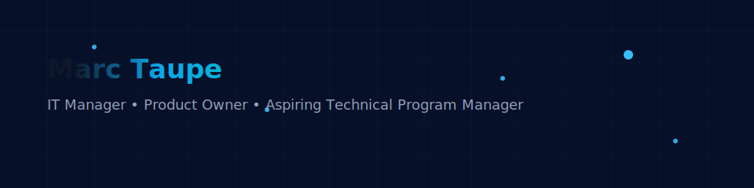

# Hi there 👋 I'm [Your Name]

## 🔭 About me
I build and coordinate secure, large-scale government IT systems. Currently transitioning into Technical Program Management for high-impact AI projects.

## 🛠️ Skills
- **Program / Product:** Technical program management, roadmap definition, stakeholder management, Agile/Scrum
- **Systems / Infra:** Linux, networking basics, identity systems, ITIL
- **Tools:** Jira, Confluence, Git, Docker, Azure/AWS basics
- **Languages:** German (native), English (professional)

## 🚀 Selected Projects
- **SIS II Integration** — Led integration of Austria's person & object search systems with the Schengen Information System (SIS II). Responsible for stakeholder coordination, security compliance, and delivery.
- **Internal IT Automation** — Built/managed automation for internal IT requests, reducing turnaround by ~40%.

## 📫 Get in touch
- LinkedIn: [your-linkedin]
- Email: your.email@domain

## 📈 GitHub Stats
<!-- optional: use services like https://github.com/anuraghazra/github-readme-stats -->

